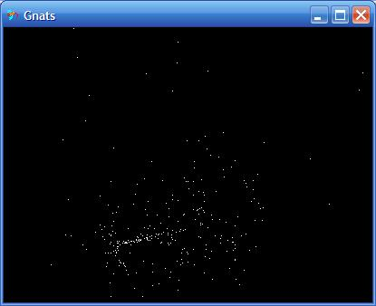



## Swarm of Gnats

### Description

This is a swarm of gnats flying around trying to catch the loan female. I guess it's like 300 heat seeking missiles! This was actually inspired by the snow falling programs posted on PSC last winter. [UPDATE MARCH 2010] Re-worked the math to use ATAN2 - makes it much simpler, added mouse button functionality (cool patterns y'all). Should be easy to adapt to your game that needs a heat-seeking missile or 300.
 
### More Info
 

             |
---                |---
**Submitted On**   |2010-03-11 13:33:12
**By**             |[Paul Bahlawan](https://github.com/Planet-Source-Code/PSCIndex/blob/master/ByAuthor/paul-bahlawan.md)
**Level**          |Beginner
**User Rating**    |5.0 (55 globes from 11 users)
**Compatibility**  |VB 5\.0, VB 6\.0
**Category**       |[Miscellaneous](https://github.com/Planet-Source-Code/PSCIndex/blob/master/ByCategory/miscellaneous__1-1.md)
**World**          |[Visual Basic](https://github.com/Planet-Source-Code/PSCIndex/blob/master/ByWorld/visual-basic.md)
**Archive File**   |[Swarm\_of\_G2176823112010\.zip](https://github.com/Planet-Source-Code/paul-bahlawan-swarm-of-gnats__1-61716/archive/master.zip)

